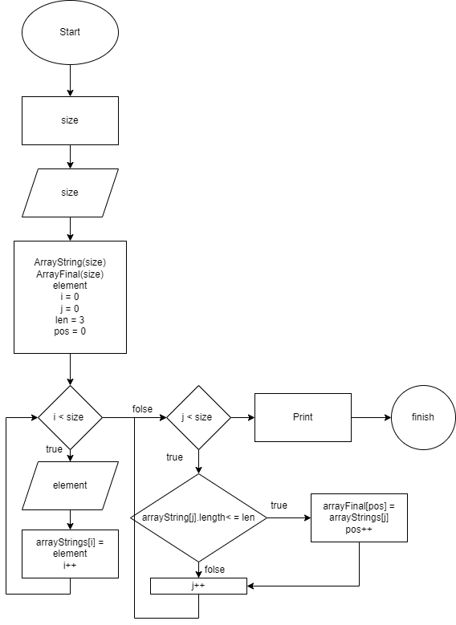

Задача 
Создать Репазиторий на GitHub
Нарисовать Блок схему алгаритм 
Снабдить репазиторий офармленным тектовым описанием решения
Написать программу решающую паставленную задачу 
Исползовать контроль версий в работе над этим небольшим проектом 